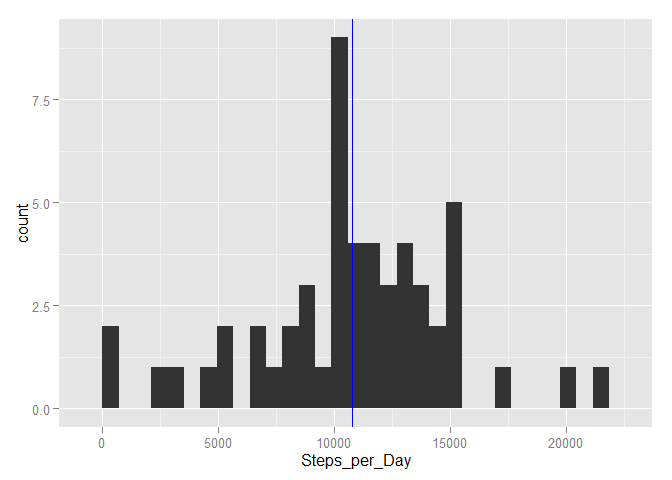
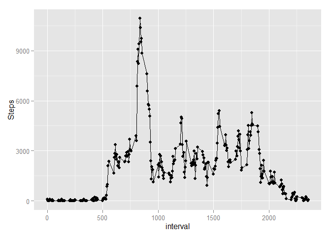
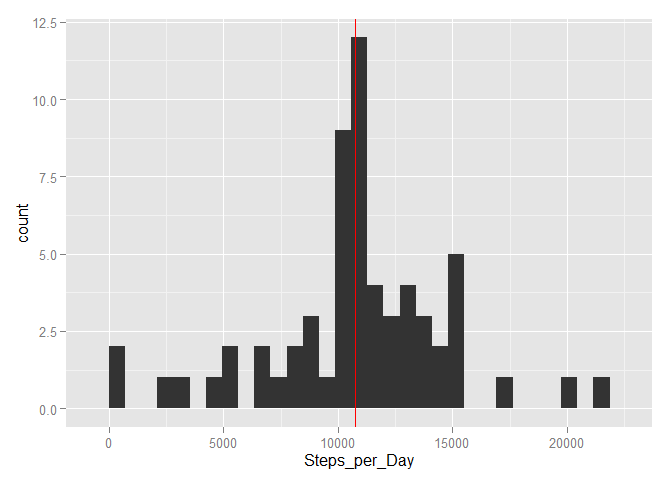
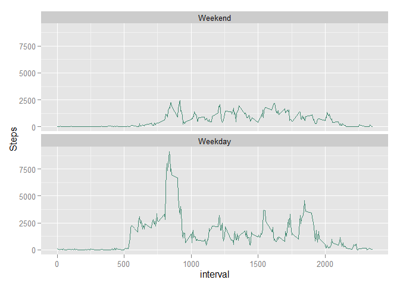

# Reproducible Research: Peer Assessment 1
## Loading and preprocessing the data

```r
library(dplyr)
```

```
## 
## Attaching package: 'dplyr'
## 
## The following objects are masked from 'package:stats':
## 
##     filter, lag
## 
## The following objects are masked from 'package:base':
## 
##     intersect, setdiff, setequal, union
```

```r
ACT <- read.csv("activity.csv")
```

## What is mean total number of steps taken per day?

### Make a histogram of the total number of steps taken each day

```r
library(ggplot2)
ACT2 <- ACT %>% select(1:2) %>% group_by(date) %>% summarise(Steps_per_Day = sum(steps)) %>% filter(!is.na(Steps_per_Day))
##make the histogram
p <- qplot(Steps_per_Day, data = ACT2)
p+geom_vline(color = "red", xintercept = mean(ACT2$Steps_per_Day))+geom_vline(color = "blue", xintercept = median(ACT2$Steps_per_Day))
```

```
## stat_bin: binwidth defaulted to range/30. Use 'binwidth = x' to adjust this.
```

 

### Calculate and report the mean and median total number of steps taken per day

```r
##report mean and median
mean(ACT2$Steps_per_Day)
```

```
## [1] 10766.19
```

```r
median(ACT2$Steps_per_Day)
```

```
## [1] 10765
```

```r
##for Q4
intervalmean <- mean(ACT2$Steps_per_Day)/288
```

## What is the average daily activity pattern?

### Make a time series plot of the 5-minute interval and the average number of steps taken, averaged across all days

```r
##make graph
ACT3 <- ACT %>% filter(!is.na(steps)) %>% select(1,3) %>% group_by(interval) %>% summarise(Steps = sum(steps))
p2 <- qplot(interval, Steps, data = ACT3)
p2+geom_line()
```

 

### Which 5-minute interval, onaverage across all the days in the dataset, contains the maximum number of steps?

```r
##report interval with max number of steps
ACT3[which.max(ACT3$Steps),1:2]
```

```
## Source: local data frame [1 x 2]
## 
##   interval Steps
##      (int) (int)
## 1      835 10927
```

## Imputing missing values

### Calculate and report the total number of missing values in the dataset

```r
##report number of missing values
sum(is.na(ACT$steps))
```

```
## [1] 2304
```

### Create new dataset, with NA filled in; make a histogram of the total number of steps taken each day

```r
##make new data set, with all NA filled in
noNAact <- ACT
noNAact[is.na(noNAact$steps),1] <- intervalmean
noNAact <- noNAact %>% select(1:2) %>% group_by(date) %>% summarise(Steps_per_Day = sum(steps))
##make the histogram
p3 <- qplot(Steps_per_Day, data=noNAact)
p3+geom_vline(color = "red", xintercept = mean(noNAact$Steps_per_Day))
```

```
## stat_bin: binwidth defaulted to range/30. Use 'binwidth = x' to adjust this.
```

 

### calculate and report the mean and median total number of steps taken per day. Do they differ from Q1? What is the impact of filling in the missing data?

```r
mean(noNAact$Steps_per_Day)
```

```
## [1] 10766.19
```

```r
median(noNAact$Steps_per_Day)
```

```
## [1] 10766.19
```

Because I decided to fill the missing values with `intervalmean`, which is the daily step total mean from Q2 divided into 288 (number of intervals per day), it isn't surprising to see that there was little effect on mean or median.

The one thing that did change is the frequency that the mean value appeared, as can be seen in the two histograms.

## Are there differences in activity patterns between weekdays and weekends?

### Create a new factor variable with two levels : "weekday" and "weekend"

```r
ACT4 <- ACT %>% filter(!is.na(steps))
ACT4$date <- as.Date(ACT4$date)
weekdays1 <- c("Monday","Tuesday","Wednesday","Thursday","Friday")
ACT4$wDay <- factor((weekdays(ACT4$date) %in% weekdays1), levels = c(FALSE, TRUE), labels = c("Weekend", "Weekday"))
ACT4 <- ACT4 %>% select(-date) %>% group_by(interval, wDay) %>% summarise(Steps= sum(steps))
```

### Make a panel plot containing a time series plot of the 5-minute interval and the average number of steps taken, averaged across all weekday days or weekend days.

```r
ggplot(ACT4, aes(interval, Steps))+geom_line(color="aquamarine4")+facet_wrap(~wDay, nrow=2)
```

 
